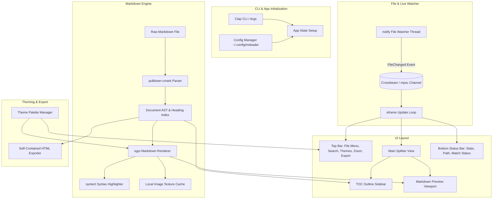

# Implementation Plan: `mdeader` (Rust Markdown Reader)

`mdeader` is a standalone, fast, and customizable Markdown reader built in Rust using `eframe` (egui). It provides a rich reading experience with live file-watching, syntax-highlighted code blocks, a table of contents outline sidebar, document search, customizable themes and typography, file switching, document statistics, and HTML export.

---

## Architecture Overview

---

## User Review Required

> [!IMPORTANT]
> **Pure Native Rendering Approach**: We are using `eframe`/`egui` with `pulldown-cmark` and `syntect`. This delivers 60+ FPS instantaneous rendering, zero external web engine dependencies, and low memory footprint (~30MB vs 300MB+ for Electron/WebKit).

> [!NOTE]
> **Image & Local Asset Resolution**: Relative image paths (e.g. ``) will resolve relative to the directory of the currently opened Markdown file.

---

## Proposed Changes

### 1. Cargo Project Setup & Dependencies
Initialize the Rust binary project in the root directory `/home/nick/Documents/Projects/Tools/mdeader`.

#### [NEW] `Cargo.toml`
Dependencies to include:
- `eframe = { version = "0.28", default-features = false, features = ["default_fonts", "glow", "wayland", "x11"] }`
- `egui = "0.28"`
- `pulldown-cmark = { version = "0.11", default-features = false, features = ["simd"] }`
- `syntect = { version = "5.2", default-features = false, features = ["default-syntaxes", "default-themes"] }`
- `notify = "6.1"`
- `notify-debouncer-mini = "0.4"`
- `rfd = "0.14"` (Native file dialogs)
- `image = { version = "0.25", default-features = false, features = ["png", "jpeg", "webp"] }`
- `clap = { version = "4.5", features = ["derive"] }`
- `serde = { version = "1.0", features = ["derive"] }`
- `toml = "0.8"`
- `directories = "5.0"`
- `open = "5.3"`
- `arboard = "3.4"` (Clipboard operations)
- `walkdir = "2.5"`

---

### 2. Configuration & Theming System

Manage persistent user preferences in `~/.config/mdeader/config.toml`.

#### [NEW] `src/config.rs`
- User preferences struct:
  - Active theme (e.g. `GitHubDark`, `GitHubLight`, `CatppuccinMocha`, `CatppuccinLatte`, `Dracula`, `Nord`, `SolarizedDark`, `SolarizedLight`).
  - Typography settings: font size (default `15.0`), line spacing (`1.4`), heading scale multipliers.
  - Sidebar visibility (`show_toc: bool`) and width.
  - Recent files list (up to 15 entries).
  - Auto-reload preference (`watch_mode: bool`).
- Functions for loading, modifying, and auto-saving configuration.

#### [NEW] `src/theme.rs`
- Defines theme color palettes:
  - Background, foreground/body text, muted text, heading colors (H1-H6).
  - Code block background, inline code background and borders.
  - Blockquote left border accent and background fill.
  - Table header fill, row alternating colors, and grid lines.
  - Syntect theme mapping (e.g. `base16-ocean.dark`, `InspiredGitHub`, `Solarized (dark)`, etc.).
- Converts theme palette to `egui::Visuals` for a consistent look across UI widgets (buttons, search inputs, scrollbars).

---

### 3. Markdown Parser & Document Model

#### [NEW] `src/document.rs`
- Parses markdown text using `pulldown-cmark`.
- Collects:
  - **Heading outline**: List of `(level, title, anchor_id, text_offset)` for TOC navigation.
  - **Document statistics**: Word count, character count, line count, and estimated reading time.
  - **Parsed AST elements**: Headings, paragraphs, blockquotes, lists (ordered, unordered, task lists), tables, code blocks, horizontal rules, images, and links.
- Handles document search query: tracks matches and byte/character indices for jumping and highlighting.

---

### 4. Syntax Highlighting & Image Loading

#### [NEW] `src/syntax.rs`
- Singleton/cached wrapper around `syntect::parsing::SyntaxSet` and `syntect::highlighting::ThemeSet`.
- Tokenizes code blocks by language tag (`rs`, `python`, `js`, `json`, `sh`, `bash`, `html`, etc.).
- Converts `syntect` colored spans into `egui::text::LayoutJob` with appropriate font styles.

#### [NEW] `src/image_loader.rs`
- Resolves relative and absolute image paths relative to the opened file's directory.
- Decodes image bytes via `image` crate and registers texture handles with `egui::Context`.
- Caches textures by canonical file path.

---

### 5. Table of Contents & Navigation

#### [NEW] `src/toc.rs`
- Renders hierarchical outline tree in the left panel.
- Shows heading indentation by level (H1 to H6).
- Highlights the current heading or clicked section.
- Signals smooth scroll target to the main preview viewport.

---

### 6. Markdown Renderer Viewport

#### [NEW] `src/renderer.rs`
- Custom `egui` renderer for CommonMark nodes:
  - **Headers**: Styled font sizes, bottom accent separator for H1/H2, registered scroll anchors.
  - **Paragraphs**: Styled inline spans (bold, italic, strikethrough, inline code, links).
  - **Code blocks**: Syntax-highlighted text block with language badge and a hoverable "Copy" button.
  - **Task lists**: Checkbox icons with checked/unchecked state.
  - **Blockquotes**: Indented block with accent vertical border and muted text.
  - **Tables**: Styled rows, headers with background tint, cell padding, column alignment.
  - **Search highlighting**: Highlights matching terms with bright amber/yellow background tint and auto-scrolls to active match.
  - **Interactive Links**: External URLs open in system browser (`open::that`), local `.md` links switch the opened document directly in `mdeader`.

---

### 7. File Watcher & Live Reload

#### [NEW] `src/watcher.rs`
- Uses `notify-debouncer-mini` to watch the currently opened file.
- Debounces file modifications (250ms delay) to prevent partial reads while editors write.
- Sends message over channel to request repaint and reload file content while preserving scroll position and search term.

---

### 8. Exporter

#### [NEW] `src/export.rs`
- Exports the currently opened Markdown file to standalone HTML.
- Inlines CSS matching the current theme (GitHub, Catppuccin, Dracula, etc.).
- Uses `pulldown-cmark` + syntax-highlighted code blocks for styled HTML export.
- Opens file save dialog via `rfd`.

---

### 9. Main Application & UI Assembly

#### [NEW] `src/app.rs`
- Core `eframe::App` implementation:
  - Top Toolbar:
    - Open File button (`Ctrl+O`), Recent Files dropdown.
    - TOC sidebar toggle (`Ctrl+B`).
    - Search trigger (`Ctrl+F`) and search bar with Prev/Next buttons.
    - Theme selector dropdown.
    - Font zoom controls (`Ctrl++`, `Ctrl+-`, `Ctrl+0`).
    - Export button (Save as HTML, Copy Raw / Rendered).
  - Left Panel: Collapsible Table of Contents (TOC).
  - Central Panel: Scrollable Markdown Preview.
  - Bottom Status Bar: Word count, character count, reading time, zoom %, live-reload indicator, active file path.
  - Keyboard Shortcuts:
    - `Ctrl+O`: Open file
    - `Ctrl+R`: Force reload
    - `Ctrl+F`: Find in document
    - `Escape`: Close find bar
    - `Ctrl+B`: Toggle TOC sidebar
    - `Ctrl+=` / `Ctrl+-`: Zoom in/out
    - `Ctrl+0`: Reset zoom
    - `Ctrl+E`: Export to HTML

#### [NEW] `src/main.rs`
- CLI parsing via `clap` (accepts optional file path, `--theme`, `--zoom`).
- Loads config and initializes `eframe` window with native titlebar, custom icon, and minimum dimensions.

---

## Verification Plan

### Automated Tests
- Unit tests for markdown AST parsing and heading extraction:
  `cargo test --bin mdeader -- document`
- Unit tests for theme colors and config serialization:
  `cargo test --bin mdeader -- config`
- Unit tests for HTML export generation:
  `cargo test --bin mdeader -- export`
- Build check across targets:
  `cargo check` and `cargo test`

### Manual Verification
1. **CLI Opening**:
   - Run `cargo run -- path/to/sample.md` and verify instant rendering.
2. **Theming**:
   - Switch between GitHub Dark, Light, Catppuccin, Dracula, Nord, Solarized; verify colors update immediately.
3. **Syntax Highlighting**:
   - Load sample file with Rust, Python, and JSON code snippets; confirm syntax colors and "Copy" button work.
4. **Table of Contents Navigation**:
   - Open a long document with multiple headings; click items in the TOC sidebar and verify the preview scrolls to the corresponding section.
5. **Live Auto-Reload**:
   - Edit the markdown file in an external editor and save; verify `mdeader` instantly re-renders without losing scroll position.
6. **In-Document Search**:
   - Press `Ctrl+F`, search for words, cycle with `Enter` / `Shift+Enter`, verify highlight and scrolling.
7. **Export**:
   - Click export to HTML, verify saved file renders with styled theme in a web browser.
